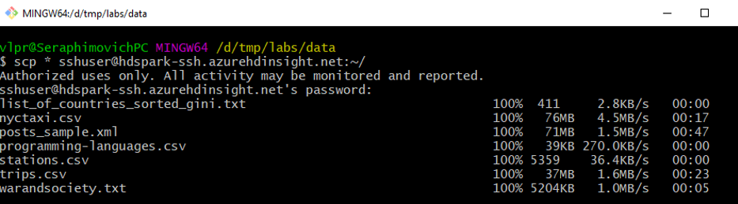
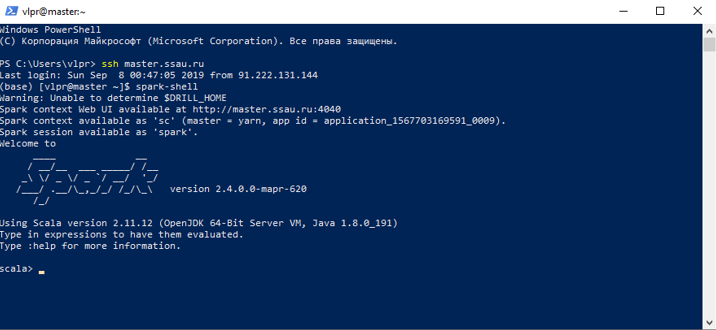
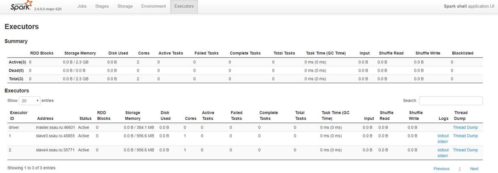
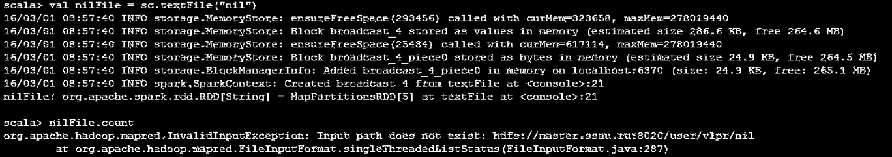
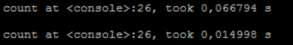
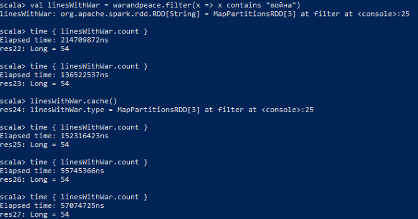
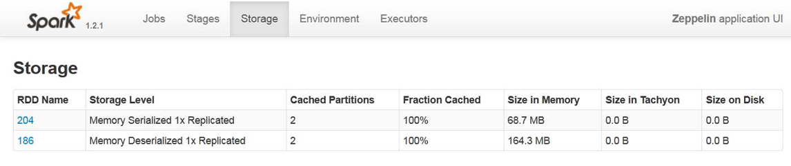

# Введение

Apache Spark — программный каркас с открытым исходным кодом для реализации распределённой обработки неструктурированных и слабоструктурированных данных, входящий в экосистему проектов Hadoop. В отличие от классического обработчика из ядра Hadoop, реализующего концепцию MapReduce с дисковым вводом и выводом, Spark специализируется на обработке в оперативной памяти, благодаря чему позволяет получать значительный выигрыш в скорости работы для некоторых классов задач. В частности, возможность многократного доступа к загруженным в память пользовательским данным делает библиотеку привлекательной для алгоритмов машинного обучения.

Главной абстракцией Spark фреймворка является распределённая коллекция элементов Resilient Distributed Dataset (RDD). К RDD можно применить трансформации (transformation) и действия (action). В первом случае в качестве результата возвращается ссылка на новый RDD, а во втором, вычисленное значение цепочки трансформаций.

В папке с заданием содержатся следующие наборы данных:
-	книга (warandpeace.txt),
-	https://databank.illinois.edu/datasets/IDB-9610843 выборка данных о поездках такси Нью-Йорка за 2010-2013 годы (nyctaxi.csv),
-	https://www.kaggle.com/benhamner/sf-bay-area-bike-share данные велопарковок Сан-Франциско (trips.csv, stations.csv).

# Цель работы

-	изучить операции загрузки и выгрузки данных в HDFS,
-	ознакомиться с базовыми операциями Apache Spark в spark-shell,
-	создать проект по обработке данных в IDE,
-	отладить анализ данных велопарковок на локальном компьютере,
-	запустить анализ данных велопарковок на сервере.

# Настройка окружения

Скачайте и запустите виртуальную машину с установленными Hadoop и Spark. Например:
-	MapR https://mapr.com/try-mapr/sandbox/,
-	Hortonworks https://www.cloudera.com/downloads/hortonworks-sandbox.html .

Либо получите доступ у администратора к https://maapr.xyz.

# Работа в консоли spark-shell/pyspark

В первой части задания вы работаете с 2 файловыми системами:
-	файловой системой Linux узла кластера, 
-	распределённой файловой системой (краткое описание приведено в приложении А).


## Основные операции взаимодействия с распределённой файловой системой MapR-FS

MapR-FS — API совместимая с HDFS реализация распределённой файловой системы (РФС) от MapR.

Для импорта/экспорта данных в РФС используйте команды `hadoop fs –put` и `hadoop fs –get`:
```
$ hadoop fs -put путь-в-локальной-системе путь-в-hdfs

$ hadoop fs -get путь-в-hdfs путь-в-локальной-системе
```
Список остальных команд для взаимодействия с РФС вы можете посмотреть, выполнив hadoop fs без дополнительных ключей. Мы рассмотрим примеры работы с наиболее полезными командами далее.

Переместите необходимые для работы наборы данных в РФС. Для этого сначала скопируйте их в файловую систему узла кластера с помощью команды scp, утилиты WinSCP или плагина NetBox Far менеджера.
```bash
$ scp * mapr@192.168.81.129:~/
mapr@192.168.81.129's password:
list_of_countries_sorted_gini.txt                                 100%  411    14.7KB/s   00:00
nyctaxi.csv                                                       100%   76MB  48.2MB/s   00:01
posts_sample.xml                                                  100%   71MB  49.4MB/s   00:01
programming-languages.csv                                         100%   39KB   9.2MB/s   00:00
stations.csv                                                      100% 5359     1.4MB/s   00:00
trips.csv                                                         100%   37MB  38.8MB/s   00:00
warandsociety.txt                                                 100% 5204KB  55.1MB/s   00:00
```


Затем на удалённой машине, находясь в директории с перемещёнными файлами, используйте команду 
```bash
$ hadoop fs -put * .
```
Проверьте, переместились ли файлы.

```bash
$ hadoop fs -ls
```
Следует обратить внимание на то, что в команде не указывалась директория, то есть использовалась директория по умолчанию.

Попробуйте другие команды, например `-mkdir`, `-cat`, `-df`, `-du`. После того как вы освоитесь с перемещением данных в РФС, запустите spark-shell.



Веб-страница запущенной сессии.



*Примечание.* Попытка привязки веб интерфейса начинается с номера порта 4040 и продолжаются с увеличением на единицу пока не будет найден свободный порт.

Зайдите на веб-страницу менеджера ресурсов YARN. Ваше приложение должно присутствовать в списке в статусе RUNNING. Spark может быть запущен в нескольких режимах: локальном, standalone (собственный менеджер ресурсов), yarn и mesos (внешние менеджеры ресурсов).

В Spark History Server вы можете посмотреть информацию о выполненных Spark задачах.

**Таблица 1. Порты сервисов в виртуальной машине MapR**
| Сервис   | Порт  |
|  :---  | ------------- |
| YARN | 8090 |
| Spark History Server	| 18080 |
| MapR Control System	| 8443 |


## Создание Resilient Distributed Dataset

Создайте RDD для текстового файла warandpeace.txt. Для подробного списка операций считывания файлов обращайтесь к документации класса SparkContext https://spark.apache.org/docs/2.4.0/api/scala/index.html#org.apache.spark.SparkContext.

*Примечание.* При наборе команд используйте TAB $-$ функцию автодополнения.

Scala
```scala
val warandpeace = sc.textFile("warandsociety.txt")
```
Python
```python
warandpeace = sc.textFile("warandsociety.txt")
```

В данной команде указывается относительный путь, который начинается с вашей папки в РФС.

Выведите количество строк файла.

Scala
```scala
warandpeace.count
```
*Примечание.* При отсутствии у функции аргументов, в scala скобки можно опускать.

Python
```python
warandpeace.count()
```
Попробуйте считать несуществующий файл, например `nil`, а затем вывести количество его строк на экран

Scala
```scala
val nilFile = sc.textFile("nil")
nilFile.count
```

Python
```python
nilFile = sc.textFile("nil")
nilFile.count()
```


Заметьте, что первая команда выполняется успешно, а вторая выводит сообщение, что такого файла нет. Это происходит потому, что выполнение обработки в Spark является ленивым и не запускается, до встречи команды действия(action). `count` $-$ первая команда действия, с которой вы познакомились.

Считайте первые 10 строк файла warandsociety.txt.

Scala
```scala
warandpeace.take(10)
```

Python
```python
warandpeace.take(10)
```

Эта команда не требует считывания и передачи на главный узел всех данных RDD.

Узнайте на сколько частей разделились данные в кластере.

Scala
```scala
warandpeace.partitions
```
~Python~


Если используется определённый метод распределения вы можете получить данные о нём командой `partitioner`. Начиная с версии 1.6.0 доступна команда `warAndPeaceFile.getNumPartitions` для получения информации о количестве разделов.

Создайте распределённую коллекцию из нескольких элементов и для каждого элемента верните ip адрес, на котором он расположен:
```scala
sc.parallelize(Array(1,2,3)).map(x => java.net.InetAddress.getLocalHost).collect
```
## Обработка текста

Найдите строки, в которых содержится слово "война".

Scala
```scala
val linesWithWar = warandpeace.filter(x => x.contains("война"))
```
Python
```python
linesWithWar = warandpeace.filter(x => "война" in x)
```
*Примечание.* Аргументом filter является лямбда функция $-$ функция без имени.  До обозначения => в скобках через запятую следуют переменные аргументов функции, затем следует команда языка Scala. При использовании фигурных скобок язык позволяет описывать лямбда функции с цепочкой команд в теле, аналогично именованным функциям.

Запросите первую строку. Строкой в данном файле является целый абзац, так как только по завершению абзаца содержится символ переноса строки.

Scala
```scala
linesWithWar.first
```
Python
```python
linesWithWar.first()
```

Данные могут быть перемещены в кэш. Этот приём очень полезен при повторном обращении к данным, для запросов "горячих" данных или запуска итеративных алгоритмов.

Перед подсчётом количества элементов вызовите команду кэширования `cache()`. Трансформации не будут обработаны, пока не будет запущена одна из команд - действий.

Воспользуйтесь следующим блоком кода для замера времени выполнения команды.

Scala
```scala
def time[R](block: => R): R = {    
	val t0 = System.nanoTime()
  val result = block    // call-by-name
	val t1 = System.nanoTime()
	println("Elapsed time: " + (t1 - t0) + "ns")
	result
}
```

```scala
linesWithWar.cache()
time{ linesWithWar.count() }
time{ linesWithWar.count() }
```






Python
```python
def time(f):    
    import time
    t = time.process_time()
    f()
    print(f"Elapsed time: {int((time.process_time() - t)*1e9)} ns")

```

```python
linesWithWar.cache()
time(lambda: linesWithWar.count() )
time(lambda: linesWithWar.count() )
```


При выполнении команды count второй раз вы должны заметить небольшое ускорение. Кэширование небольших файлов не даёт большого преимущества, однако для огромных файлов, распределённых по сотням или тысячам узлов, разница во времени выполнения может быть существенной. Вторая команда `linesWithWar.count()` выполняется над результатом от предшествующих команде cache трансформаций и на больших объёмах данных будет ускорять выполнение последующих команд.

Найдите гистограмму слов:

Scala
```scala
val wordCounts = linesWithWar.flatMap(line => line.split(" ")).map(word => (word, 1)).reduceByKey((a, b) => a + b)
```
Python
```python
wordCounts = linesWithWar.flatMap(lambda line: line.split(" ")).map(lambda word: (word, 1)).reduceByKey(lambda a, b: a + b)
```

Spark существенно упростил реализацию многих задач, ранее решаемых с использованием MapReduce. Эта однострочная программа $-$ WordCount $-$ является наиболее популярным примером задачи, эффективно распараллеливаемой в Hadoop кластере. Её реализация в MapReduce занимается около 130 строк кода.

Сохраните результаты в файл, а затем, найдите данные в HDFS и выведите данные в linux консоли с помощью команды `hadoop fs -cat warandpeace_histogram.txt/*` (здесь используется относительный путь).

Scala/Python
```scala
wordCounts.saveAsTextFile("warandpeace_histogram.txt")
```

```bash
$ hadoop fs -cat warandpeace_histogram.txt/*
```

*Упражнение.* Улучшите процедуру, убирая из слов лишние символы и трансформируя все слова в нижний регистр. Используйте регулярные выражения. Например, по регулярному выражению "\\w*".r следующий код

Scala
```scala
"\\w*".r.findAllIn("a b c").toArray.foreach(println)
```
Python
```python
import re
p = re.compile('\w+')
letters = p.findall("a b c")
[print(l) for l in letters]
```

выведет на каждой строке по букве. Кроме Scala консоли для тестирования регулярных выражений вы можете использовать сайты:
-	https://regex101.com/,
-	https://www.debuggex.com/.


## Операции с множествами

Инициализируйте два множества

Scala
```scala
val a = sc.parallelize(Array(1,2,3,4))
val b = sc.parallelize(Array(3,4,6,7))
```
Python
```python
a = sc.parallelize([1,2,3,4])
b = sc.parallelize([3,4,6,7])
```

Найдите объединение a и b и соберите данные на главный узел с помощью функции collect.

Scala/Python
```scala
a.union(b).collect
```


Обратите внимание, что общие элементы дублируются, поэтому результат не является классическим множеством на самом деле. Такое поведение делает это операцию очень дешёвой, так как обновляется только информация о местонахождении данных для данного RDD.  Уберите дубликаты с помощью distinct.

Scala/Python
```scala
a.union(b).distinct().collect()
```

Найдите пересечение множеств.

Scala/Python
```scala
a.intersection(b).collect()
```

Найдите разность множеств.

Scala/Python
```scala
a.subtract(b).collect()
```

*Примечание.* При запуске collect на центральный узел - driver передаются все данные из распределённого RDD. При работе с большим объемом данных выполнение данной команды может заполнить всю оперативную память driver узла.

*Упражнение.* Найдите в исходном коде Spark определение функции distinct. Объясните почему реализация этой операции действительно убирает дубликаты.

## Общие переменные

В Apache Spark общими переменными являются широковещательные  (**broadcast**) переменные и аккумулирующие (**accumulator**) переменные.

### Широковещательные переменные

Общие переменные удобны если вы обращаетесь к небольшому объёму данных на всех узлах. Например, это могут быть параметры алгоритмов обработки, небольшие матрицы.

В консоли, с которой вы работали в предыдущем разделе, создайте широковещательную переменную. Наберите:

Scala
```scala
val broadcastVar = sc.broadcast(Array(1,2,3))
```
Python
```python
broadcastVar = sc.broadcast([1,2,3])
```

Для получения значения обратитесь к полю value:

Scala/Python
```scala
broadcastVar.value
```

### Аккумулирующие переменные

Аккумулирующие переменные являются объектами, которые могут быть изменены только ассоциативной операцией добавления. Они используются для эффективной реализации счётчиков и суммарных значений. Вы можете также использовать свой тип, над котором определена ассоциативная операция при необходимости.  

Особенностью использования переменной является возможность доступа к значению только на узле в driver процессе.

Потренируйтесь в создании аккумулирующих переменных:

Scala
```scala
val accum = sc.longAccumulator
```
Python
```python
accum = sc.accumulator(0)
```

Следующим шагом запустите параллельную обработку массива и в каждом параллельном задании добавьте к аккумулирующей переменной значение элемента массива:

Scala
```scala
sc.parallelize(Array(1,2,3,4)).foreach(x => accum.add(x))
```
Python
```python
sc.parallelize([1,2,3,4]).foreach(lambda x: accum.add(x))
```

Для получения текущего значения вызовите команду:

Scala/Python
```scala
accum.value
```

Результатом должно быть число 10.
Пары ключ-значение
Создайте пару ключ-значение из двух букв:

Scala
```scala
val pair = ('a', 'b')
```
Python
```python
pair = ('a', 'b')
```

Для доступа к первому значению обратитесь к полю _1:

Scala
```scala
pair._1
```
Python
```python
pair[0]
```

Для доступа к второму значению к полю _2:

Scala
```scala
pair._2
```
Python
```python
pair[1]
```

Если распределённая коллекция состоит из пар, то они трактуются как для ключ-значение и для таких коллекций доступны дополнительные операции. Наиболее распространённые, это: группировка по ключу, агрегирование значений с одинаковыми ключами, объединение двух коллекций по ключу.

Вы можете выйти из консоли нажатием сочетания клавиш CTRL+D.

К текущему моменту вы познакомились со следующими командами действий: `count`, `first`, `take`, `saveAsTextFile`, `collect`, `foreach`. Полный список команд действий вы можете найти в документации соответствующей версии Spark http://spark.apache.org/docs/latest/rdd-programming-guide.html#actions.

## Топ-10 популярных номеров такси

Проанализируем данные о поездках такси в Нью-Йорке и найдём 10 номеров такси, которые совершили наибольшее количество поездок.

В первую очередь будет необходимо загрузить данные в MapR-FS. Создайте новую папку в MapR-FS:

Создайте RDD на основе загруженных данных nyctaxi.csv:

Scala
```scala
val taxi = sc.textFile("nyctaxi.csv")
```
Python
```python
taxi = sc.textFile("nyctaxi.csv")
```

Выведите первые 5 строк из данной таблицы:

Scala
```scala
taxi.take(5).foreach(println)
```
Python
```
for t in taxi.take(5):
    print(t)
```

Обратите внимание, что первая строка является заголовком. Её как правило нужно будет отфильтровать. Одним из эффективных способов является следующий:

Scala
```scala
taxi.mapPartitionsWithIndex{(idx,iter)=> if (idx==0) iter.drop(1) else iter }
```
Python
```python
import itertools
taxi.mapPartitionsWithIndex(lambda idx, it:  itertools.islice(it,1,None) if (idx==0) else it  )
```

*Примечание.* Для анализа структурированных табличных данных рассматривайте в качестве альтернативы использование SQL API и DataSet API.

Для разбора значений потребуется создать RDD, где каждая строка разбита на массив подстрок. Используйте запятую в качестве разделителя. Наберите:

Scala
```scala
val taxiParse = taxi.map(line=>line.split(","))
```
Python
```python
taxiParse = taxi.map(lambda line: line.split(","))
```

Теперь преобразуем массив строк в массив пар ключ-значение, где ключом будет служить номер такси (6 колонка), а значением единица.

Scala
```scala
val taxiMedKey = taxiParse.map(row => (row(6), 1))
```
Python
```python
taxiMedKey = taxiParse.map(lambda row: (row[6], 1))
```

Следом мы можем найти количество поездок каждого номера такси:

Scala
```scala
val taxiMedCounts = taxiMedKey.reduceByKey((v1, v2) => v1+v2)
```
Python
```python
taxiMedCounts = taxiMedKey.reduceByKey(lambda v1, v2: v1+v2)
```

Выведем полученные результаты в отсортированном виде:

Scala
```scala
taxiMedCounts.map(_.swap).top(10).map(_.swap).foreach(println)
```
Python
```python
top10 = taxiMedCounts.map(lambda x: x[::-1]).top(10)
for x in top10:
    print(x[::-1])
```

*Примечание.* Нотация `_.swap` является объявлением анонимной функции от одного аргумента, аналог записи  `x => x.swap`.

Являются ли обе map операции распределёнными? Найдите в документации Spark в классах RDD или PairRDDFunctions метод top.

Вы также можете сгруппировать все описанные выше трансформации, преобразующие исходные данные в одну цепочку:

Scala
```scala
val taxiCounts = taxi.map(line=>line.split(",")).map(row=>(row(6),1)).reduceByKey(_ + _)
```
Python
```python
taxiCounts = taxi.map(lambda line: line.split(",")).map(lambda row: (row[6],1)).reduceByKey(lambda a,b: a + b)
```

*Примечание.* Нотация `_ + _` является объявлением анонимной функции от двух аргументов, аналог более многословной записи `(a,b) => a + b`.

Попробуйте найти общее количество номеров такси несколько раз, предварительно объявив RDD taxiCounts как сохраняемую в кэше:

Scala/Python
```scala
taxiCounts.cache()
```

Сравните время, которое трансформации выполняются первый раз и второй. Чем больше данные, тем существеннее разница.

Scala
```scala
time{ taxiCounts.count() }
time{ taxiCounts.count() }
```

Python
```python
time(lambda: taxiCounts.count())
time(lambda: taxiCounts.count())
```

## Настройка способа хранения RDD

В данной части будет рассмотрена настройка способов хранения RDD. Вы сравните различные способы хранения, включая: хранение в сериализованном виде,  в исходном, с репликацией.

Scala
```scala
taxi.persist(StorageLevel.MEMORY_ONLY)
```

Python
```python
import pyspark
taxi.persist(storageLevel=pyspark.StorageLevel.MEMORY_ONLY)
```

https://spark.apache.org/docs/latest/api/python/reference/api/pyspark.StorageLevel.html?highlight=storagelevel#pyspark.StorageLevel



Другими способами хранения являются:

-	MEMORY_AND_DISK,
-	MEMORY_AND_DISK_SER,
-	DISK_ONLY,
-	MEMORY_ONLY_2,
-	MEMORY_AND_DISK_2,
-	OFF_HEAP.

Подробнее о способах хранения вы можете узнать по адресу http://spark.apache.org/docs/latest/programming-guide.html#rdd-persistence 

# Следующие шаги

#### 1. Проведите анализ данных велопарковок на языке Python в интерактивном режиме из Jupyter книг:
  - `L1_interactive_bike_analysis_python_with_rdd.ipynb`, 
  - `L1_interactive_bike_analysis_python_with_dataframes.ipynb`.

#### 2. Проведите анализ данных велопарковок на языке Scala или Python в неинтерактивном режиме (`--deploy-mode cluster`). Инструкции по созданию и запуску приложений:
  - Scala `L1_noninteractive_bike_analysis_scala.md`
  - Python `L1_noninteractive_bike_analysis_scala.py`
 
#### 3. Решите задачи [L1_Apache_Spark_Tasks.md](L1_Apache_Spark_Tasks.md)
    
