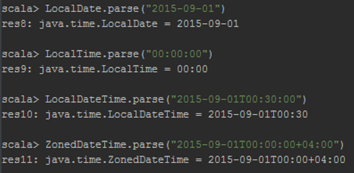

# Создание локального проекта

Разработка программы на Spark может быть выполнена на нескольких языках: Python, R, Scala, Java. В данном руководстве рассмотрим разработку на последних двух, так как они имеют самую полную поддержку API обработки данных.

Разработка приложения может производиться в любом текстовом редакторе, затем быть собрана системой сборки в отдельное приложение и запущена на Spark кластере с помощью консольной команды spark-submit.

В данной лабораторной работе мы будем использовать IntelliJ IDEA. IDE предоставляет набор возможностей для упрощения разработки: автодополнение, индексация проекта, статическая проверка кода, подсветка синтаксиса, интеграция с системами контроля версий и системами сборки.

Для работы необходима установленная последняя версия IDE IntelliJ IDEA Community Edition. Данная среда разработки доступа для скачивания по адресу https://www.jetbrains.com/idea/.

Для создания проекта в IntelliJ IDEA запустите среду разработки, выберите Create New Project.


 
## Разработка с использованием системы сборки SBT на языке Scala

Для создания Scala + SBT проекта выберите слева в меню Scala и затем SBT.


Далее укажите имя проекта, версию Java,  версию SBT и версию Scala компилятора. Для разработки на Spark 2.4.0 рекомендуется выбрать версию Scala 2.12.9.

*Примечание.* Установите флаг Use auto-import для того, чтобы не обновлять зависимости вручную при изменениях в проекте.


После нажатия Finish откроется главное окно среды разработки.


Подождите, когда SBT скачает зависимости.


В дереве проекта должен появиться файл `build.sbt`, являющийся основным файлом для настройки сборки и указания зависимостей проекта SBT. В файле на момент создания указаны: имя проекта, версия проекта, версия языка Scala.

*Примечание.* Появление предупреждений о конфликте имён в SBT 0.13.8 является известной ошибкой https://github.com/sbt/sbt/issues/1933. Одно из  решений — использование более ранней версии или скрытие всех предупреждений установкой степени логирования `logLevel := Level.Error`.


Код Scala помещается в папку `src/main/scala` или `src/main/scala-2.12`.

Создайте в папке scala объект Main c методом main. Данный метод будет точкой входа в программу.


*Примечание.* Аналогом объекта object в Java является паттерн Singleton. Выполнения тела объекта происходит при его загрузке в память, аналогично инициализации в конструкторе, методы object доступны без создания объекта оператором new, аналогично публичным статическим методам.

```scala
object Main {
	def main(args: Array[String]) {
		println("Hello world")
	}
}
```

В контекстном меню выберите Run 'Main', либо нажмите сочетание клавиш Ctrl+Shift+F10.


После выполнения в консоли должно появиться приветствие.


Добавьте к проекту зависимость Spark (версия на MapR кластере), записав следующие строки в конце файла build.sbt:

```scala
libraryDependencies ++= Seq(
	"org.apache.spark" %% "spark-core" % "2.4.0"
)
```

Сохраните изменения и обновите проект.


Подождите, когда SBT скачает все зависимые библиотеки.

Измените код `Main.scala` и создайте простейшую Spark программу. Импортируйте классы пакета `org.apache.spark`.

```scala
import org.apache.spark._
```

Создайте конфигурацию Spark с помощью класса SparkConf. Укажите обязательные параметры: имя запускаемой задачи (имя контекста задачи) и режим запуска (список режимов http://spark.apache.org/docs/latest/submitting-applications.html#master-urls). В нашем случае в качестве режима будет указан параметр `local[2]`, означающий запуск с двумя потоками на локальной машине. В качестве режима может быть указан адрес главного узла.

```scala
val cfg = new SparkConf()
          .setAppName("Test").setMaster("local[2]")
```

*Примечание.* В Scala различаются два вида переменных: `val` и `var`. Переменные `val` являются неизменяемыми и инициализируются один раз, в отличие от `var`, которой можно присваивать новые значения несколько раз.

Инициализируйте контекст Spark в главном методе.

```scala
val sc = new SparkContext(cfg)
```

Добавьте в конец файла команду остановки контекста

```scala
sc.stop()
```

После инициализации контекста вы можете обращаться к командам Spark. Считайте любой текстовый файл из локальной файловой системы и выведите его по строкам в консоль.

*Примечание.* Путь к файлу в локальной файловой системе имеет определённый формат, имеющий префикс "file:///". https://tools.ietf.org/html/rfc8089

```scala
val textFile = sc.textFile("file:///c:/temp/file.txt")
textFile.foreach(println)
```


*Примечание.* При работе без winutils.exe запись в файловую систему будет порождать ошибку. Известным решением является скачивание данного файла из проекта Hadoop в файловую систему в папку с названием bin и указанием переменной Spark `hadoop.home.dir`. В переменной `hadoop.home.dir`  хранится путь к папке c Hadoop определённой версии. Установить переменную среды JVM вы можете кодом `System`.`setProperty(key, value)` . Другим решением проблемы является установка переменной среды `HADOOP_HOME` (потребуется перезапуск IDE). https://issues.apache.org/jira/browse/SPARK-2356.

## Анализ данных велопарковок

Тестовыми данными являются список поездок на велосипедах `trips.csv` и список велостоянок проката велосипедов `stations.csv`.

 

Создайте по одному RDD на основе каждого файла `stations.csv`, `trips.csv`. Считайте данные в переменную, затем запомните заголовок. Объявите новую переменную с данными, в которых не будет заголовка, а строки преобразованы в массивы строк в соответствии с разделителем — запятая.

*Примечание.* Существует более эффективный, но громоздкий способ исключить заголовок из данных с использованием метода mapPartitionWithIndex. Пример присутствует в первой части лабораторной работы в разделе нахождения десяти популярных номеров такси.

```scala
val tripData = sc.textFile("file:///z:/data/trips.csv")

// запомним заголовок, чтобы затем его исключить
val tripsHeader = tripData.first
val trips = tripData.filter(row=>row!=tripsHeader).map(row=>row.split(",",-1))

val stationData = sc.textFile("file:///z:/data/stations.csv")
val stationsHeader = stationData.first
val stations = stationData.filter(row=>row!=stationsHeader).map(row=>row.split(",",-1))
```

*Примечание.* Использование в качестве второго параметра -1 в `row.split(",",-1)` позволяет не отбрасывать пустые строки. Например `"1,2,".split(",")` вернёт `Array("1","2")`, а `"1,2,".split(",",-1)` вернёт `Array("1","2","")`.

Выведите заголовки таблиц и изучите колонки csv файлов.

```scala
stationsHeader
tripsHeader
```

Выведите несколько элементов данных в trips и stations.

*Примечание.* Убрать информационные строки логов из выдачи можно следующим образом:

```scala
import org.apache.log4j.{Logger, Level}
Logger.getLogger("org.apache.spark").setLevel(Level.WARN)
Logger.getLogger("org.spark-project").setLevel(Level.WARN)
```

Объявите `stationsIndexed` так, чтобы результатом был список пар ключ-значение с целочисленным ключом  из первой колонки.  Таким образом вы создаёте индекс на основе первой колонки - номера велостоянки

```scala
val stationsIndexed = stations.keyBy(row=>row(0).toInt)
```

*Примечание.* Обращение к массиву в Scala производится в круглых скобках. Например Array(1,2,3)(0) вернёт первый элемент.

Выведите часть данных нового RDD.

Аналогичное действие проделайте для индексирования коллекции trips по колонкам Start Terminal и  End Terminal и сохраните результат в переменные, например tripsByStartTerminals и tripsByEndTerminals.

Выполните операцию объединения коллекций по ключу с помощью функции join. Объедините stationsIndexed и tripsByStartTerminals, stationsIndexed и tripsByEndTerminals.

```scala
val startTrips = stationsIndexed.join(tripsByStartTerminals)
val endTrips = stationsIndexed.join(tripsByEndTerminals)
```

Объявление последовательности трансформаций приводит к созданию ацикличного ориентированного графа. Вывести  полученный граф можно для любого RDD.

```scala
startTrips.toDebugString
endTrips.toDebugString
```
 


Выполните  объявленные графы трансформаций вызовом команды count.

```scala
startTrips.count()
endTrips.count()
```

Если вы знаете распределение ключей заранее, вы можете выбрать оптимальный способ хеширования ключей по разделам `Partition`. Например, если один ключ встречается на порядки чаще, чем другие ключи, то использование `HashPartitioner` будет не лучшим выбором, так как данные связанные с этим ключом будут собираться в одном разделе. Это приведёт к неравномерной нагрузке на вычислительные ресурсы.

Выбрать определённую реализацию класса распределения по разделам можно с помощью функции RDD `partitionBy`. Например, для RDD `stationsIndexed`  выбирается `HashPartitioner` с количеством разделов равным количеству разделов trips RDD.

```scala
stationsIndexed.partitionBy(new HashPartitioner(trips.partitions.size))
```

Также можно создавать свои классы для распределения ключей. Узнать какой класс назначен для текущего RDD можно обращением к полю partitioner.

```scala
stationsIndexed.partitioner
```

## Создание модели данных

Для более эффективной  обработки и получения дополнительных возможностей мы можем объявить классы сущностей предметной области и преобразовать исходные строковые данные в объявленное представление.

В Scala часто для объявления структур данных используется конструкция case class. Особенностью такого объявления класса являются: автоматическое создание методов доступа get для аргументов конструктора, автоматическое определение методов hashcode и equals, возможность case классов быть разобранными по шаблону (pattern matching). Например, для определения

```scala
case class IntNumber(val value:Integer)
```

выполнение

```scala
new IntNumber(4).value
```

вернёт значение 4.

Объявите case классы для представления строк  таблиц в соответствии с именами заголовков.

```scala
case class Station(
  stationId:Integer,
  name:String,
  lat:Double,
  long:Double,
  dockcount:Integer,
  landmark:String,
  installation:String,
  notes:String)

case class Trip(
  tripId:Integer,
  duration:Integer,
  startDate:LocalDateTime,
  startStation:String,
  startTerminal:Integer,
  endDate:LocalDateTime,
  endStation:String,
  endTerminal:Integer,
  bikeId: Integer,
  subscriptionType: String,
  zipCode: String)
```

Для конвертации времени будем использовать пакет java.time. Краткое введение в работу с пакетом находится в Приложении Б. Объявим формат данных.

```scala
val timeFormat = DateTimeFormatter.ofPattern("M/d/yyyy H:m")
```

Объявим trips с учётом преобразования во внутреннее представление.

```scala
val tripsInternal = trips.mapPartitions(rows => {
  val timeFormat = DateTimeFormatter.ofPattern("M/d/yyyy H:m")
  rows.map( row =>
    new Trip(tripId=row(0).toInt,
      duration=row(1).toInt,
      startDate= LocalDate.parse(row(2), timeFormat),
      startStation=row(3),
      startTerminal=row(4).toInt,
      endDate=LocalDate.parse(row(5), timeFormat),
      endStation=row(6),
      endTerminal=row(7).toInt,
      bikeId=row(8).toInt,
      subscriptionType=row(9),
      zipCode=row(10)))})
```

Изучите полученные данные. Например, вызовом следующих команд:

```scala
tripsInternal.first
tripsInternal.first.startDate
```

*Примечание.* В связи с тем, что timeFormat содержит несериализуемый объект, его необходимо создавать на каждом узле для каждой партиции.

То же можно проделать и для station RDD

```scala
val stationsInternal = stations.map(row=>
	new Station(stationId=row(0).toInt,
                name=row(1),
                lat=row(2).toDouble,
                long=row(3).toDouble,
                dockcount=row(4).toInt,
                landmark=row(5),
                installation=row(6)
                notes=null))
```

*Примечание.* Восьмая колонка не присутствует в таблице, так как в данных она пустая. Если в будущем она не будет использоваться, имеет смысл её убрать из описания case класса.

*Примечание.* В данных присутствуют различные форматы времени.

Посчитаем среднее время поездки, используя  groupByKey.

Для этого потребуется преобразовать trips RDD в RDD коллекцию пар ключ-значение аналогично тому, как мы совершали это ранее методом keyBy.

```scala
val tripsByStartStation = tripsInternal.keyBy(record => record.startStation)
```

Рассчитаем среднее время поездки для каждого стартового парковочного места

```scala
val avgDurationByStartStation = tripsByStartStation
 .mapValues(x=>x.duration)
 .groupByKey()
 .mapValues(col=>col.reduce((a,b)=>a+b)/col.size)
```

Выведем первые 10 результатов

```scala
avgDurationByStartStation.take(10).foreach(println)
```

Выполнение операции groupByKey приводит к интенсивным передачам данных. Если группировка делается для последующей редукции элементов лучше использовать трансформацию reduceByKey или aggregateByKey. Их выполнение приведёт сначала к локальной редукции над разделом Partition, а затем будет произведено окончательное суммирование над полученными частичными суммами.

*Примечание.* Выполнение reduceByKey логически сходно с выполнением Combine и Reduce фазы MapReduce  работы.

Функция aggregateByKey является аналогом reduceByKey с возможностью указывать начальный элемент.

Рассчитаем среднее значение с помощью aggregateByKey. Одновременно будут вычисляться два значения для каждого стартового терминала: сумма времён и количество поездок.

```scala
val avgDurationByStartStation2 = tripsByStartStation
  .mapValues(x=>x.duration)
  .aggregateByKey((0,0))(
   (acc, value) => (acc._1 + value, acc._2 + 1),
   (acc1, acc2) => (acc1._1+acc2._1, acc1._2+acc2._2))
  .mapValues(acc=>acc._1/acc._2)
```

В первых скобках передаётся начальное значение. В нашем случае это пара нулей. Первая анонимная функция предназначена для прохода по коллекции раздела. На этом проходе значение элементов помещаются средой в переменную value, а переменная «аккумулятора» acc накапливает значения. Вторая анонимная функция предназначена для этапа редукции частично посчитанных локальных результатов.

Сравните результаты `avgDurationByStartStation` и `avgDurationByStartStation2` и их время выполнения.

Теперь найдём первую поездку для каждой велостоянки. Для решения опять потребуется группировка. Ещё одним недостатком `groupByKey` данных является то, что для группировки данные должны поместиться в оперативной памяти. Это может привести к ошибке `OutOfMemoryException` для больших объёмов данных.

Сгруппируем поездки по велостоянкам и отсортируем поездки в группах по возрастанию даты.

```scala
val firstGrouped = tripsByStartStation
  .groupByKey()
  .mapValues(x =>
    x.toList.sortWith((trip1, trip2) =>
      trip1.startDate.compareTo(trip2.startDate)<0))
```


Лучшим вариантом с точки зрения эффективности будет использование трансформации reduceByKey

```scala
val firstGrouped = tripsByStartStation
  .reduceByKey((trip1,trip2) =>
    if (trip1.startDate.compareTo(trip2.startDate)<0)
    trip1 else trip2)
```

В данном случае «передаваться дальше» будет меньшее из значений ключа.


## Запуск проекта в кластере

Для запуска собранного проекта на сервере используйте команду `spark-submit`. Однако прежде чем собрать проект, необходимо его изменить, так как в данный момент в коде зашиты пути к файлам с данными в локальной системе и режим запуска (`setMaster(“local[2]“)`).

Параметризуйте эти значения аргументами передаваемыми в программу при запуске.

```scala
val Seq(masterURL, tripDataPath, stationDataPath) = args.toSeq
val cfg = new SparkConfig().setAppName("Test").setMaster(masterURL)

val tripData = sc.textFile(tripDataPath)
val stationData = sc.textFile(stationDataPath)
```

В конфигурации запуска добавьте значения аргументов:


Проверьте, что проект работает на локальном компьютере.

Соберите JAR с помощью sbt команды package. Файл появится в директории `target/scala-2.12`. Скопируйте его на сервер с помощью `scp` и запустите.

```
$ spark-submit --deploy-mode cluster untitled4_2.11-0.1.jar yarn /labs/lab1/trips.csv /labs/lab1/stations.csv
```

Логи YARN контейнеров вы можете найти в директории `/mapr/tmp/studX/`. Проверьте, что выдача вашей программы на сервере идентична выдаче в IDE при запуске на локальном компьютере.


# Приложение А
## Краткое описание файловой системы HDFS

HDFS — распределенная файловая система, используемая в проекте Hadoop. HDFS-кластер в первую очередь состоит из NameNоde-сервера и DataNode-серверов, которые хранят данные. NameNode-сервер управляет пространством имен файловой системы и доступом клиентов к данным. Чтобы разгрузить NameNode-сервер, передача данных осуществляется только между клиентом и DataNode-сервером.


Развёртывание экземпляра HDFS предусматривает наличие центрального узла имён (англ. name node), хранящего метаданные файловой системы и метаинформацию о распределении блоков, и серии узлов данных (англ. data node), непосредственно хранящих блоки файлов. Узел имён отвечает за обработку операций уровня файлов и каталогов — открытие и закрытие файлов, манипуляция с каталогами, узлы данных непосредственно отрабатывают операции по записи и чтению данных. Узел имён и узлы данных снабжаются веб-серверами, отображающими текущий статус узлов и позволяющими просматривать содержимое файловой системы. Административные функции доступны из интерфейса командной строки.

# Приложение Б
## Основные понятия java.time

Для представления времени в Java 8 рекомендуется использовать пакет `java.time`, реализующий стандарт JSR 310. Документация пакета `java.time` доступна по адресу https://docs.oracle.com/javase/8/docs/api/java/time/package-summary.html.  

Далее приводится работа с основными классами представления времени `java.time`. Для экспериментов удобно использовать REPL консоль. Если вы находитесь в среде разработки IDEA Scala консоль может быть запущена нажатием Ctrl+Shift+D, либо через контекстное меню Intellij IDEA.

Примечание. REPL (от сокращения `read`, `eval`, `print`, `loop` - считать, выполнить, напечатать, повторять в цикле)  интерактивный цикл взаимодействия программной среды с пользователем.


 
Примечание. Консоль также можно запустить в командном окне операционной системы с помощью sbt console, находясь в папке с проектом. В обоих вариантах зависимости проекта подключаются автоматически так, что вы можете работать со сторонними библиотеками.

В пакете java.time различаются представления времени:
-	класс Instant — хранит числовую метку;
-	класс LocalDate — хранит дату без времени;
-	класс LocalTime — хранит время без даты;
-	класс LocalDateTime — хранит время и дату;
-	класс ZonedDateTime — хранит дату, время и часовой пояс.

Узнайте в консоли текущее время, вызвав статический метод now() у каждого класса, изучите возвращаемое представление. Например,

``` scala
import java.time._
Instant.now()
```

Перед  использованием классов объявите их импорт. Символ «_» импортирует все классы данного пакета.

Enter используется для переноса строки.  Для выполнения нажмите сочетание клавиш Ctrl+Enter.


Создайте примечательную вам дату с помощью статического конструктора of классов `LocalDate`, `LocalDateTime`, `ZonedDateTime`. Воспользуйтесь подсказками среды разработки или документацией для определения количества аргументов метода of и их значения.


Изучите создание времён и дат с помощью метода parse данных классов. Используйте форматирование, которое выдавалось системой при возвращении значения в консоль.



Для задания пользовательского формата считывания вы можете использовать класс DateTimeFormatter. Описание класса и символов шаблона располагается по адресу https://docs.oracle.com/javase/8/docs/api/java/time/format/DateTimeFormatter.html.

