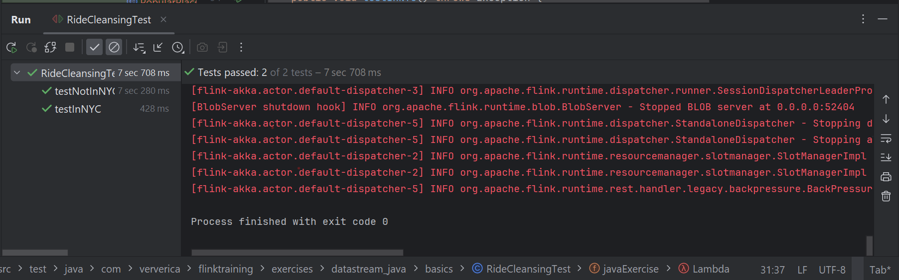
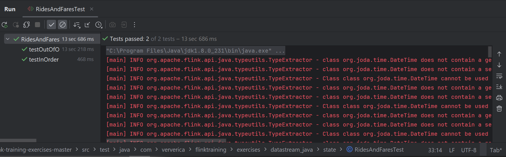
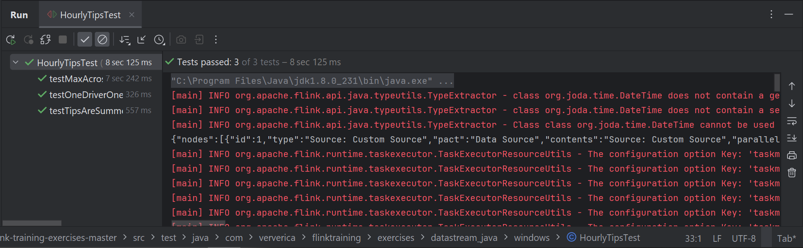
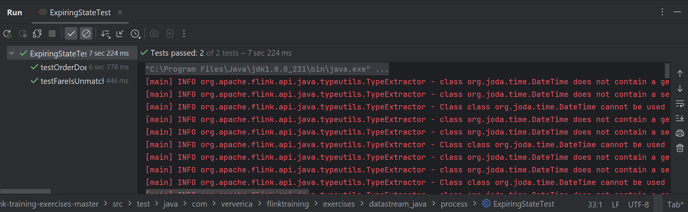

## 1. RideCleanisingExercise
[Решение](../flink-training-exercises-master/src/main/java/com/ververica/flinktraining/exercises/datastream_java/basics/RideCleansingExercise.java).  

## 2. RidesAndFaresExercise
[Решение](../flink-training-exercises-master/src/main/java/com/ververica/flinktraining/exercises/datastream_java/state/RidesAndFaresExercise.java).  

## 3. HourlyTipsExerxise
[Решение](../flink-training-exercises-master/src/main/java/com/ververica/flinktraining/exercises/datastream_java/windows/HourlyTipsExercise.java).  

## 4. ExpiringStateExercise
[Решение](../flink-training-exercises-master/src/main/java/com/ververica/flinktraining/exercises/datastream_java/process/ExpiringStateExercise.java).  
